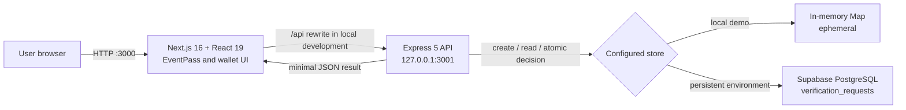
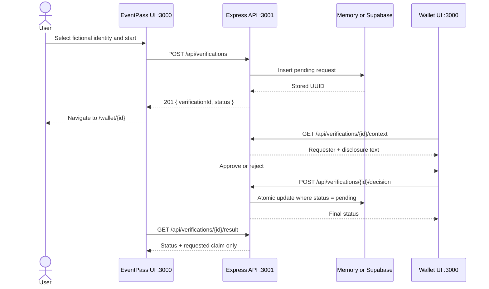
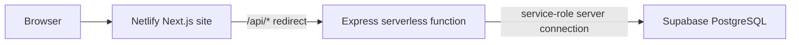
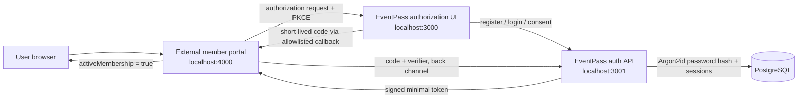

# EventPass hackathon presentation content

## Communication goal

By the end of the presentation, hackathon judges should understand that EventPass is a working selective-disclosure demo that proves a service can make an access decision from one consented yes/no claim instead of collecting a complete identity profile, and that its current architecture provides a credible path to a reusable authentication and authorization service.

## Slide 1 — EventPass

**Title:** Prove eligibility without surrendering your identity

**Subtitle:** A working selective-disclosure simulator for privacy-preserving access decisions

**Presenter line:** Most services do not need to know who you are. They need to know whether one condition is true.

---

## Slide 2 — The data request is usually larger than the decision

Many access decisions are binary:

- Is the account membership active?
- Is the user eligible for a student benefit?
- Does the user meet a residency requirement?

Traditional identity flows can expose a full profile even when the relying party needs only one answer. EventPass demonstrates a smaller trust boundary: request one claim, obtain explicit consent, return one result.

**Judge takeaway:** Data minimization is enforced at the API response boundary, not left to interface copy alone.

---

## Slide 3 — EventPass shares the decision, not the profile

### Relying party receives

- Verification request ID
- Request status
- Only the requested Boolean claim after approval
- A safe reason code when the requirement fails or the user rejects

### Relying party does not receive

- Full name in the result response
- Exact age or date of birth
- ID number
- Address
- Full identity profile
- Attributes unrelated to the request

Example successful response:

```json
{
  "verificationId": "<uuid>",
  "status": "verified",
  "verified": true,
  "claims": { "ageOver18": true }
}
```

This is selective disclosure at the API boundary. The current demo does not claim cryptographic selective disclosure.

---

## Slide 4 — The user stays in control through four visible steps

1. **Request** — EventPass creates a verification for one claim.
2. **Review** — The wallet shows who is asking, what will be shared, and what will stay private.
3. **Consent** — The user explicitly approves or rejects. No decision is automatic.
4. **Result** — EventPass reads a server-confirmed result and displays a privacy receipt.

State outcomes are deliberately different:

- `verified`: requirement met; Boolean result shared.
- `failed`: requirement not met; Boolean `false` shared after approval.
- `rejected`: user declined; no claim result shared.
- `pending`: no decision yet; no claim result shared.

---

## Slide 5 — Current implementation: three layers, one narrow trust boundary



### Connection details

- Browser entry point: `http://localhost:3000/event`
- Next.js local API proxy: `/api/:path*` → `http://127.0.0.1:3001/api/:path*`
- Express listener: `127.0.0.1:3001`
- Persistent storage: Supabase JavaScript client with server-only service-role key
- Production routing: Netlify `/api/*` redirect → Express serverless function
- Cache policy: API responses include `Cache-Control: no-store`

---

## Slide 6 — One verification is an auditable API sequence



### API endpoints

| Method | Endpoint | Purpose |
| --- | --- | --- |
| `POST` | `/api/verifications` | Create a pending request from a validated fictional user ID and claim |
| `GET` | `/api/verifications/:id/context` | Provide wallet review and disclosure context |
| `POST` | `/api/verifications/:id/decision` | Record one approve/reject decision |
| `GET` | `/api/verifications/:id/result` | Return the relying-party-safe result |

---

## Slide 7 — The database preserves state and prevents ambiguous outcomes

The `verification_requests` table stores:

| Field | Role |
| --- | --- |
| `id` | UUID primary key |
| `user_id` | One of three fictional demo identities |
| `claim` | Requested claim only |
| `status` | `pending`, `verified`, `failed`, or `rejected` |
| `result` | Nullable Boolean; absent before evaluation or after rejection |
| `reason_code` | Safe machine-readable failure/rejection reason |
| `created_at`, `decided_at` | Request and decision timestamps |

Database constraints keep state combinations valid. Supabase row-level security is enabled, and access is revoked from `anon` and `authenticated`; only the server-side service-role connection is used.

Decision writes are atomic: the update succeeds only while the stored status is still `pending`. A second or concurrent decision receives `409 ALREADY_DECIDED`.

---

## Slide 8 — Security is designed into the boundary

- Zod strictly validates UUIDs, user IDs, claims, and decisions.
- JSON request bodies are capped at 8 KB.
- Express disables `x-powered-by`.
- Every request receives a safe request ID for troubleshooting.
- Responses use `Cache-Control: no-store`.
- Structured errors avoid leaking stack traces or database messages.
- The browser never receives the Supabase service-role key.
- Result pages consume only the relying-party result endpoint, never wallet context.
- Duplicate consent actions are blocked in the UI and API.
- An ambiguous decision failure triggers a re-read before another submission is allowed.

**Scope statement:** The current build uses fictional identities and contains no passwords, government identifiers, or real authentication credentials.

---

## Slide 9 — The stack is modern, testable, and deployable

| Layer | Technology | Implementation role |
| --- | --- | --- |
| Web UI | Next.js 16, React 19, TypeScript | App Router screens and navigation |
| Design system | Tailwind CSS 4, Radix Slot, Lucide | Responsive and accessible UI primitives |
| API | Express 5 | Verification lifecycle and error contract |
| Validation | Zod 4 | Strict request validation |
| Storage | Supabase/PostgreSQL or in-memory Map | Persistent production-like or zero-config local mode |
| Testing | Vitest, Supertest | API behavior and concurrency tests |
| Deployment | Netlify, serverless-http | Next.js frontend plus Express function routing |
| Tooling | Node.js, npm, tsx, concurrently | Development and build orchestration |

Quality commands: `npm test`, `npm run lint`, `npm run typecheck`, and `npm run build`.

---

## Slide 10 — A three-path demo proves the meaningful states

### Path A — successful claim

Omar → Approve → `verified` → `ageOver18: true`

### Path B — unmet requirement

Sara → Approve → `failed` → `ageOver18: false`

### Path C — consent refusal

Omar → Reject → `rejected` → empty `claims` object

### Live demonstration steps

1. Run `npm install` once.
2. Run `npm run dev` from the `hack` directory.
3. Open `http://localhost:3000/event`.
4. Show the requested disclosure before approving.
5. Show the privacy receipt and optional exact API result.
6. Repeat with Sara and then a rejection to prove that failure and refusal are different states.

---

## Slide 11 — Local and deployed connections use the same API contract

### Local development

```text
Terminal 1 command: npm run dev
Next.js UI:       http://localhost:3000
Express API:      http://127.0.0.1:3001
Storage default:  in-memory, cleared on API restart
```

`npm run dev` uses `concurrently` to start `next dev` and `tsx watch server/dev.ts`. Next.js rewrites browser `/api` requests to Express, so the browser stays on one origin.

### Persistent Supabase mode

1. Execute `supabase/schema.sql` in Supabase.
2. Set `SUPABASE_URL` and `SUPABASE_SERVICE_ROLE_KEY` in the server environment.
3. Keep the service-role key server-only; never prefix it with `NEXT_PUBLIC_`.

### Netlify deployment



Netlify deliberately disallows the in-memory fallback, preventing a deployment from silently using non-persistent storage.

---

## Slide 12 — Next phase: turn the simulator into a reusable authorization service

**This architecture is proposed; it is not part of the current build.**

Replace the age example with a practical claim such as `activeMembership` and separate the relying party from the identity service.



### Proposed trust rules

- Store normalized email plus an Argon2id password hash; never store plaintext passwords.
- Register each client ID and exact callback URI.
- Use authorization code flow with PKCE.
- Make codes short-lived, single-use, and bound to the client and redirect URI.
- Return only the approved claim, for example `{ "activeMembership": true }`.
- Keep relying-party sessions separate from EventPass sessions.
- Add logout, expiry, replay protection, rate limiting, and credential tests.

---

## Slide 13 — EventPass turns privacy into an integration contract

The working demo already proves:

- A relying party can request one claim.
- A user can review and reject the exact disclosure.
- The API can return a decision without returning the full profile.
- Persistence, validation, concurrency handling, error recovery, testing, and deployment paths are implemented.

The next milestone converts that verified pattern into an external authentication service with real accounts and a standards-based authorization flow.

**Closing line:** Ask for the fact you need—not the identity you do not.

---

## Suggested judge Q&A

### Is this zero-knowledge proof technology?

No. The current demo demonstrates selective disclosure at the API boundary. It intentionally avoids claiming cryptographic or government-backed verification. A future credential layer could replace the fictional claim source without changing the relying-party contract.

### Why does the wallet context contain a display name?

The wallet uses a fictional display name so the demo user can confirm which simulated identity is active. The relying-party result endpoint does not return that name.

### What prevents two conflicting decisions?

The store updates a decision only when the current database state is `pending`. The API returns `409 ALREADY_DECIDED` after the first accepted decision.

### Why have in-memory and Supabase modes?

In-memory mode makes the demo runnable with no external account. Supabase demonstrates the same interface with persistence. Deployment refuses the memory fallback so a production-like environment cannot silently lose state.

### What would be changed before real users?

Add account registration, Argon2id password hashing, standards-based authorization code flow with PKCE, registered client callbacks, short-lived single-use codes, signed tokens, secure cookies, rate limiting, audit events, secret rotation, and threat-model testing.

## Repository evidence

- `package.json` — framework, testing, build, and runtime dependencies
- `next.config.ts` — local `/api` rewrite to Express
- `server/dev.ts` — Express listener and local memory default
- `server/app.ts` — validation, endpoints, request IDs, cache policy, and errors
- `server/features/verifications/model.ts` — fictional identities and claim evaluation
- `server/lib/store.ts` — memory and Supabase adapters, including atomic decisions
- `src/shared/contracts.ts` — shared claim and result types
- `src/shared/api.ts` — browser request helper, timeout, and safe errors
- `src/features/event/event-page.tsx` — relying-party request UI
- `src/features/wallet/wallet-page.tsx` — review and consent flow
- `src/features/event/result-page.tsx` — result states and privacy receipt
- `supabase/schema.sql` — persistent record constraints and row-level security
- `netlify.toml` — production build and API redirect
- `server/features/verifications/model.test.ts` or `*.test.ts` — behavior and concurrency tests

